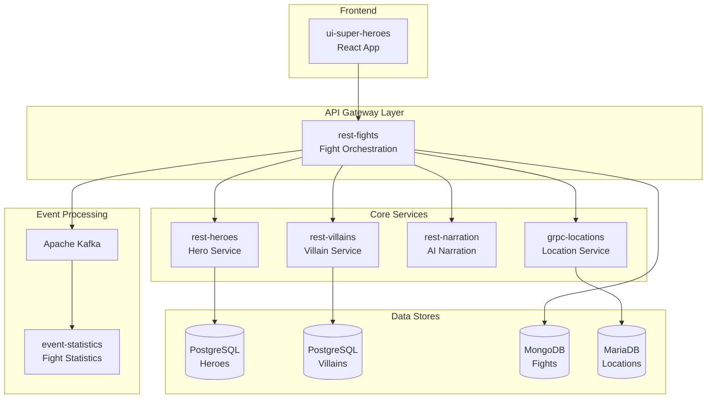

# Quarkus Super Heroes Architecture

This document provides an overview of the Quarkus Super Heroes microservices architecture and how Claude Code integrates with the development workflow.

## System Architecture



## Service Details

| Service | Technology | Database | Port | Description |
|---------|------------|----------|------|-------------|
| `rest-heroes` | Quarkus + RESTEasy Reactive | PostgreSQL | 8083 | Manages hero data (CRUD operations) |
| `rest-villains` | Quarkus + RESTEasy Reactive | PostgreSQL | 8084 | Manages villain data (CRUD operations) |
| `rest-fights` | Quarkus + RESTEasy Reactive | MongoDB | 8082 | Orchestrates fights between heroes and villains |
| `rest-narration` | Quarkus + LangChain4j | - | 8087 | Generates AI-powered fight narrations |
| `grpc-locations` | Quarkus + gRPC | MariaDB | 8089 | Provides location data via gRPC |
| `event-statistics` | Quarkus + Kafka | - | 8085 | Consumes fight events and computes statistics |
| `ui-super-heroes` | React | - | 8080 | Web frontend for the application |

## Communication Patterns

### Synchronous (REST/gRPC)
- UI communicates with `rest-fights` via REST
- `rest-fights` calls `rest-heroes`, `rest-villains`, and `rest-narration` via REST
- `rest-fights` calls `grpc-locations` via gRPC

### Asynchronous (Kafka)
- `rest-fights` publishes fight events to Kafka
- `event-statistics` consumes fight events for real-time statistics

## Key Technologies

- **Quarkus**: Supersonic Subatomic Java framework
- **Mutiny**: Reactive programming library (Uni/Multi)
- **Hibernate Reactive**: Non-blocking database access
- **SmallRye**: MicroProfile implementations (OpenAPI, Health, Metrics)
- **LangChain4j**: AI/LLM integration for narration
- **Kafka**: Event streaming platform

## Directory Structure

```
quarkus-super-heroes/
├── rest-heroes/          # Hero microservice
│   ├── src/main/java/    # Java source code
│   ├── src/main/resources/
│   │   └── application.properties
│   └── pom.xml
├── rest-villains/        # Villain microservice
├── rest-fights/          # Fight orchestration
├── rest-narration/       # AI narration service
├── event-statistics/     # Kafka consumer
├── grpc-locations/       # gRPC location service
├── ui-super-heroes/      # React frontend
├── deploy/               # Deployment configs
│   ├── docker-compose/   # Docker Compose files
│   └── k8s/              # Kubernetes manifests
└── .claude/              # Claude Code configuration
    ├── commands/         # Skill definitions
    ├── docs/             # Documentation
    └── settings.json     # Project settings
```

## Running Locally

### Prerequisites
- Java 17+
- Maven 3.8+
- Docker & Docker Compose
- Node.js 18+ (for UI)

### Start Infrastructure
```bash
cd deploy/docker-compose
docker-compose -f infrastructure.yml up -d
```

### Start Services
```bash
# In separate terminals:
./mvnw quarkus:dev -f rest-heroes/pom.xml
./mvnw quarkus:dev -f rest-villains/pom.xml
./mvnw quarkus:dev -f rest-fights/pom.xml
```

### Access Points
- UI: http://localhost:8080
- Fights API: http://localhost:8082
- Heroes API: http://localhost:8083
- Villains API: http://localhost:8084
