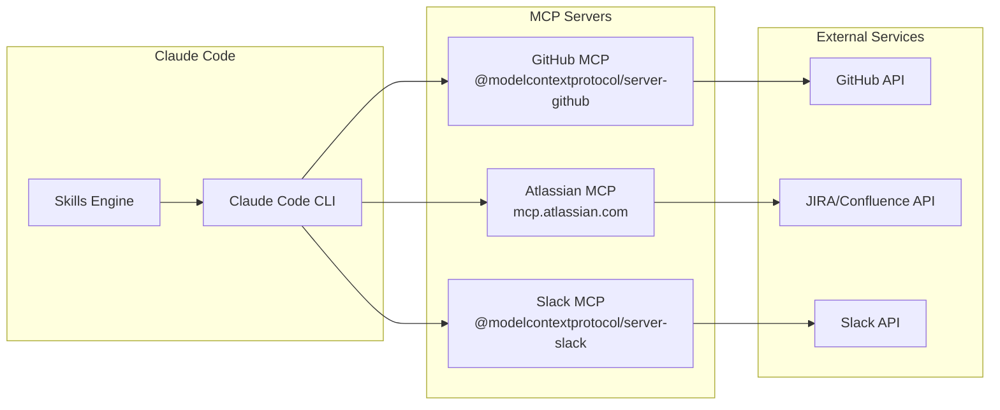
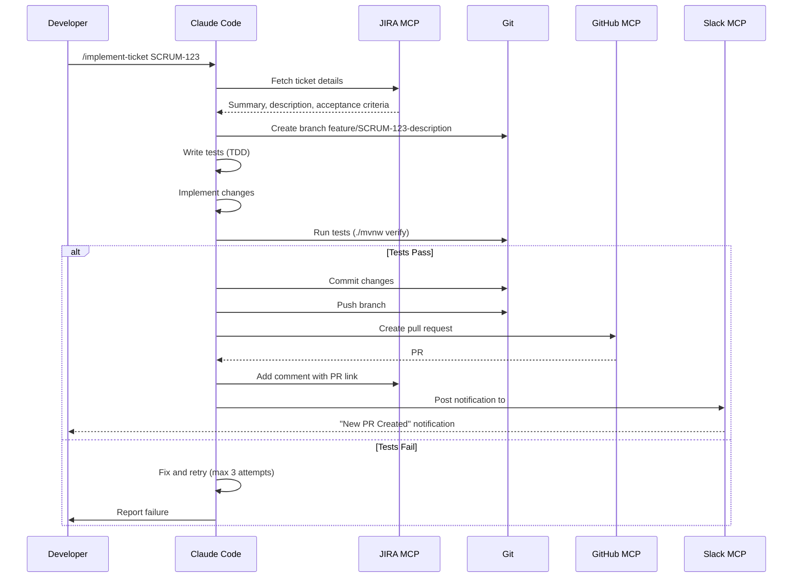
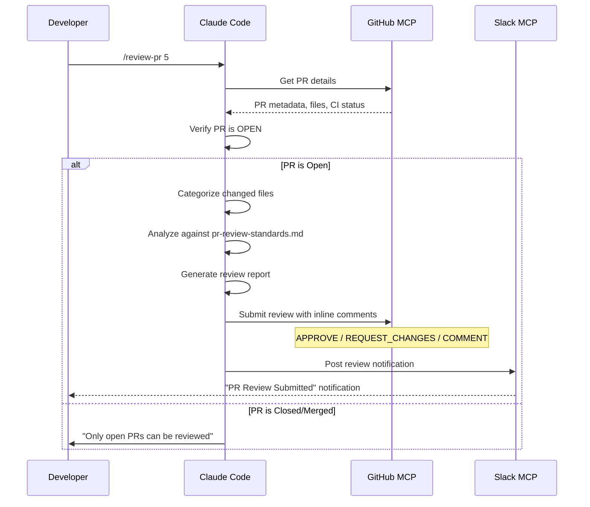
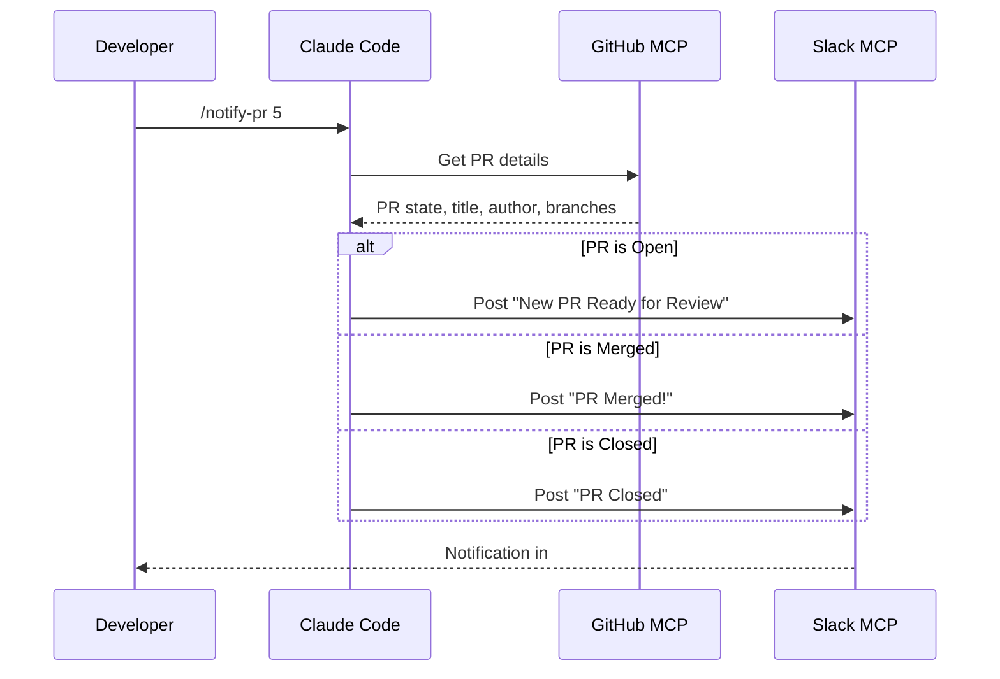

# Claude Code Integration

This document explains how Claude Code integrates with external services via MCP (Model Context Protocol) and documents the available skills.

## MCP Architecture



## MCP Server Configuration

The `.mcp.json` file configures the MCP servers:

```json
{
  "mcpServers": {
    "github": {
      "command": "npx",
      "args": ["-y", "@modelcontextprotocol/server-github"],
      "env": {
        "GITHUB_PERSONAL_ACCESS_TOKEN": "${GITHUB_TOKEN}"
      }
    },
    "atlassian-jira": {
      "command": "npx",
      "args": ["-y", "mcp-remote", "https://mcp.atlassian.com/v1/mcp"]
    },
    "slack": {
      "command": "npx",
      "args": ["-y", "@modelcontextprotocol/server-slack"],
      "env": {
        "SLACK_BOT_TOKEN": "${SLACK_BOT_TOKEN}",
        "SLACK_TEAM_ID": "${SLACK_TEAM_ID}"
      }
    }
  }
}
```

## Available Skills

### `/implement-ticket` Workflow



**Key Steps:**
1. Fetches ticket from JIRA (summary, description, acceptance criteria)
2. Creates feature branch: `feature/SCRUM-XXX-short-description`
3. Writes tests FIRST (TDD approach)
4. Implements code following project conventions
5. Runs `./mvnw verify` to validate
6. Commits with message: `feat(scope): description [SCRUM-XXX]`
7. Creates PR linking to JIRA ticket
8. Posts Slack notification to `#pull-requests`

---

### `/review-pr` Workflow



**Review Categories:**
- **Backend (Java):** Checks for constructor injection, @ApplicationScoped, reactive patterns, OpenAPI annotations
- **Frontend (React):** Functional components, hooks, no console.log
- **Tests:** Proper naming, @QuarkusTest for integration tests
- **Security:** No hardcoded credentials, input validation

**Severity Levels:**
- :red_circle: **Critical** - Security issues, blocking bugs, data loss risks
- :yellow_circle: **Important** - Performance concerns, style violations
- :bulb: **Suggestion** - Nice-to-have improvements

---

### `/notify-pr` Workflow



**Message Formats:**

**Open PR:**
```
:eyes: New PR Ready for Review

#5: feat(slack): add Slack integration [SCRUM-9]
Author: username
Branch: feature/SCRUM-9-slack → main

:point_right: Review this PR
```

**Merged PR:**
```
:tada: PR Merged!

#5: feat(slack): add Slack integration [SCRUM-9]
Author: username

:rocket: Changes are now in main
```

---

## Slack Integration Flow

```mermaid
graph TB
    subgraph "Trigger Events"
        IMP[/implement-ticket<br/>creates PR]
        REV[/review-pr<br/>submits review]
        NOT[/notify-pr<br/>manual trigger]
    end

    subgraph "Slack MCP"
        BOT[MCP Bot]
    end

    subgraph "Slack Workspace"
        CH[#pull-requests<br/>Channel]
    end

    IMP -->|New PR Created| BOT
    REV -->|Review Submitted| BOT
    NOT -->|Manual Notification| BOT
    BOT --> CH
```

### Slack Bot Permissions

Required OAuth scopes:
- `chat:write` - Send messages to channels
- `channels:read` - List and find channels

### Channel Configuration

The default channel is `#pull-requests` (ID: `C0AA38NT7BL`).

To use a different channel:
1. Find the channel ID (right-click channel > Copy link)
2. Update the channel ID in skill definitions
3. Invite the bot: `/invite @MCP Bot`

---

## Data Flow Summary

| Skill | Input | MCP Servers Used | Output |
|-------|-------|------------------|--------|
| `/implement-ticket` | JIRA ticket ID | JIRA, GitHub, Slack | PR + Slack notification |
| `/review-pr` | PR number | GitHub, Slack | Review comments + Slack notification |
| `/notify-pr` | PR number | GitHub, Slack | Slack notification |

---

## Troubleshooting

### MCP Connection Issues

```bash
# Check MCP server status
/mcp

# Reconnect a specific server
/mcp  # Then select server to reconnect
```

### Common Errors

| Error | Cause | Solution |
|-------|-------|----------|
| "not_in_channel" | Bot not invited to Slack channel | `/invite @MCP Bot` in channel |
| "401 Unauthorized" | Atlassian token expired | Run `/mcp` and reconnect |
| "Can not approve your own pull request" | Reviewing own PR | Falls back to COMMENT |
